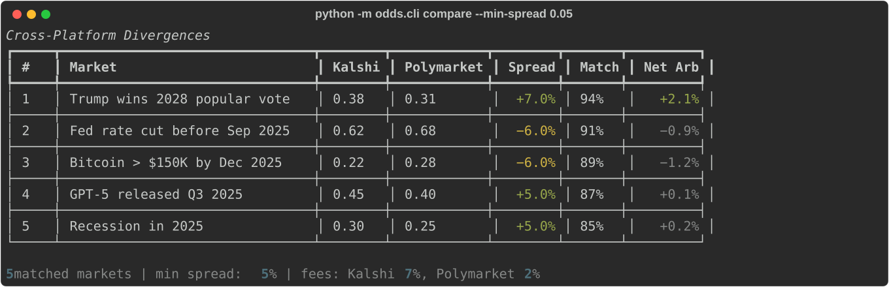

# Cross-Platform Odds Aggregator

Pulls prediction markets from Polymarket + Kalshi, normalizes to a unified schema, fuzzy-matches equivalent markets, and calculates price divergences / arb windows.

[](LICENSE)
[](https://www.python.org/downloads/)

> ⚠️ **Arb in prediction markets is rarely "free"** — consider fees, liquidity, slippage, and resolve-time risk before trading. This tool finds divergences; it does not guarantee profit.



## Features

- **Multi-source** — public Kalshi REST + Polymarket Gamma clients
- **Fuzzy matching** — rapidfuzz token sort ratio with configurable threshold
- **Arb detection** — spread calculation with fee-aware net arb
- **Rich terminal** — ranked table of divergences with match confidence

## Install

```bash
pip install -e .
```

## Quickstart

### 1. Configure API keys

```bash
cp .env.example .env
```

Public market data requires no API keys. `.env` optionally overrides `KALSHI_API_URL` and `POLYMARKET_API_URL` (Gamma). Use `--dry-run` for an offline demo.

### 2. Find divergences

```bash
# Compare markets across platforms, min 5% spread
python -m odds.cli compare --min-spread 0.05

# Demo with sample data (no API keys needed)
python -m odds.cli compare --dry-run

# Custom match threshold
python -m odds.cli compare --min-spread 0.03 --match-threshold 80
```

### Example Output

```
Cross-Platform Divergences

  Market                            Kalshi  Polymarket  Spread  Fee-adjusted estimate  Match
  Will GPT-5 launch by Dec 2026?       72%       65%       7.0%          3.0%             100%
```

This offline example uses synthetic fixture prices and the default 2% fee assumption per side.

## How It Works

### Market Matching

Markets on Kalshi and Polymarket describe the same events with different wording. The aggregator:
1. **Normalizes** question text (lowercase, punctuation, repeated spaces), preserving event numbers
2. **Fuzzy-matches** using `rapidfuzz.fuzz.token_sort_ratio` with a configurable threshold (default: 80%)
3. **Rejects** different numeric conditions and known close dates more than three days apart

Matches are candidates, not verified equivalent contracts. Missing dates are allowed, and conservative number checks can reject differently worded equivalent dates. Review resolution rules before interpreting a divergence. Live comparison reads one bounded page per source (`--limit`, default 100, maximum 1000), not the complete inventories.

### Spread & Arb Calculation

- **Spread** = absolute difference between the two YES prices; direction is recorded separately
- **Fee-adjusted estimate** = `max(0, spread − 2 × fee_rate)`
- This estimate uses observed prices and an assumed flat rate; it does not establish executable arbitrage

### Fee Model

`--fee-rate` sets an illustrative flat fee per side (default 0.02). It is not either platform's current fee schedule. The result excludes order-book depth, bid/ask differences, slippage, and settlement-rule differences; use actual platform fees and executable quotes for further research. Polymarket Gamma prices are reference outcome prices, while Kalshi uses the available YES ask.

## Architecture

```
src/odds/
├── cli.py              # Typer CLI: compare command
├── divergence.py       # Spread + net arb calculation
├── match.py            # Fuzzy matching with rapidfuzz
├── models.py           # Unified market schema
├── normalize.py        # Question text normalization
└── sources/
    ├── kalshi.py        # Kalshi REST API client
    └── polymarket.py    # Polymarket Gamma client
```

## Roadmap

- [ ] Real-time monitoring with configurable refresh interval
- [ ] Slack/Telegram alerts for actionable arbs
- [ ] Historical spread tracking
- [ ] Additional sources (Metaculus, PredictIt)

## License

MIT
